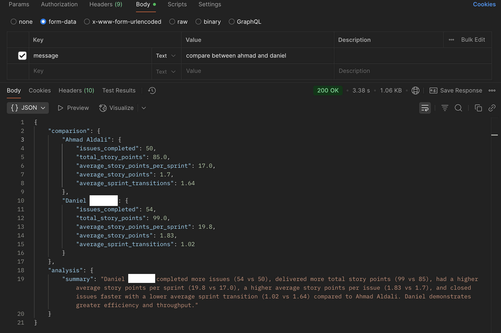
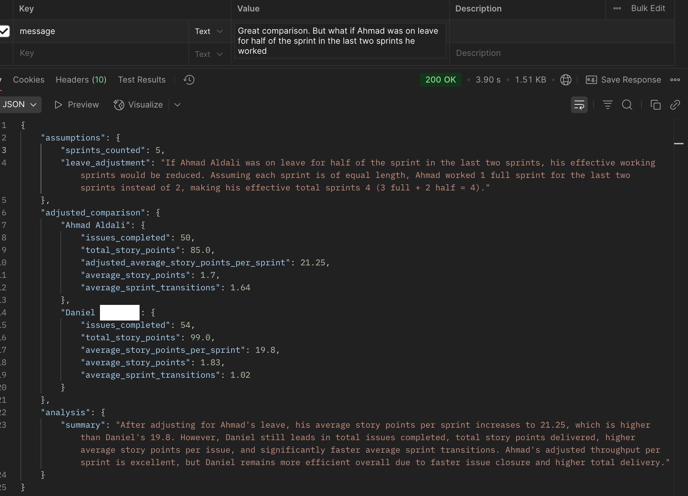

# AH-LI Sprintly

A Django-based project designed to assist with sprint planning and intelligent issue assignment.

---

## 📦 Repository

You can clone the project from the following repository:

```python
git clone https://github.com/ahmadaldali/ah-li-sprintly
```

---

## 🚀 Getting Started

### Requirements

- Python 3.8+
- Django
- Other dependencies in `requirements.txt`

### Setup

```python
# Clone the repository
git clone https://github.com/ahmadaldali/ah-li-sprintly
cd ah-li-sprintly

# Create a virtual environment
python -m venv venv
source venv/bin/activate  # On Windows: venv\Scripts\activate

# Install dependencies
pip install -r requirements.txt

# Start the development server
python manage.py runserver
```

---

## 🧠 AI App

### 🔍 Suggest an Assigner

**Endpoint:**
POST /ai/{planning_service}/suggest-assigner/<issue_id>

**Example:**
http://127.0.0.1:8000/ai/jira/suggest-assigner/35231

If you want an elite process, you can try to suggest the assigner based on the epic issues only
http://127.0.0.1:8000/ai/jira/suggest-assigner-epic/34971

```python
{
  "assigner": "<name of the most suitable developer>",
  "assigner_id": "<id of the most suitable developer>",
  "issue": "<title of the issue to be assigned>",
  "reason": "<brief explanation of why this developer is a good fit>",
  "story_points": "<The estimated effort for this task>"
}
```


### 🔍 Predict efficient developer

**Endpoint:**
POST /ai/{planning_service}/predict-efficient-developer

**Example:**
http://127.0.0.1:8000/ai/jira/predict-efficient-developer

```python
{
  "developer": "<name of the most suitable developer>",
  "developer_id": "<id of the most suitable developer>",
  "reason": "short explaniation",
  "summary": {
            <developer_name>: {
                "issues_completed",
                "average_story_points_per_sprint",
                "average_story_points",
                "average_sprint_transitions",
              }
  }
}
```


To get clarification about the result and discuss the result, you can use the following endpoint

**Endpoint:**
POST /ai/{planning_service}/predict-efficient-developer-followup

**Example:**
http://127.0.0.1:8000/ai/jira/predict-efficient-developer-followup




---

## 📋 Planning App

### 🧾 Get Unassigned Issues in Current Sprint

**Endpoint:**
GET /planning/{planning_service}/unassigned-current-issues

**Example:**
http://127.0.0.1:8000/planning/jira/unassigned-current-issues

```python
[
    {
      "id": "<issue_id>",
      "title": "<issue_title>",
      "description": "<issue_description>",
      "story_points": "<effort_estimate>",
      "epic": "<issue_topic>"
    }
]
```

## ✅  Testing
```python
python3 manage.py test
```

---

## 📫 Contact
For questions or suggestions, feel free to open an issue or submit a pull request.
